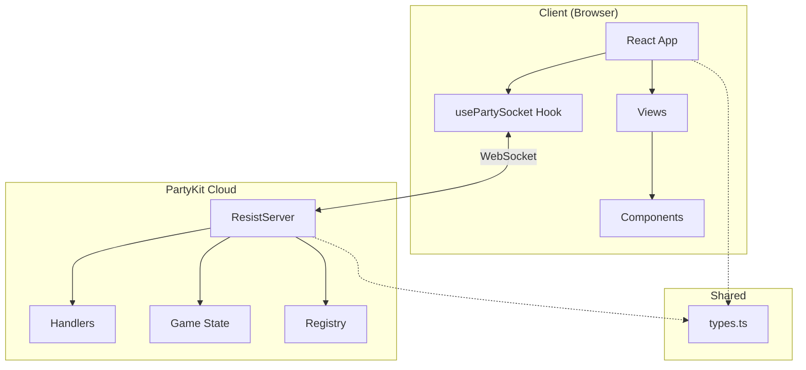
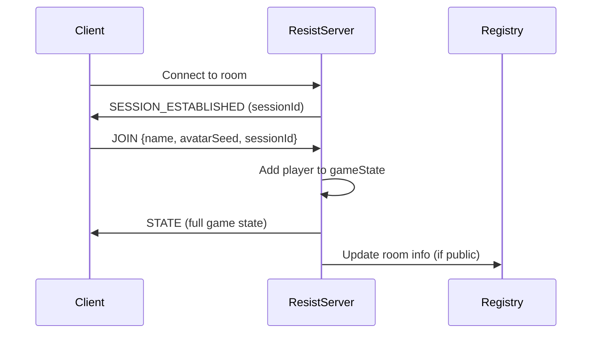
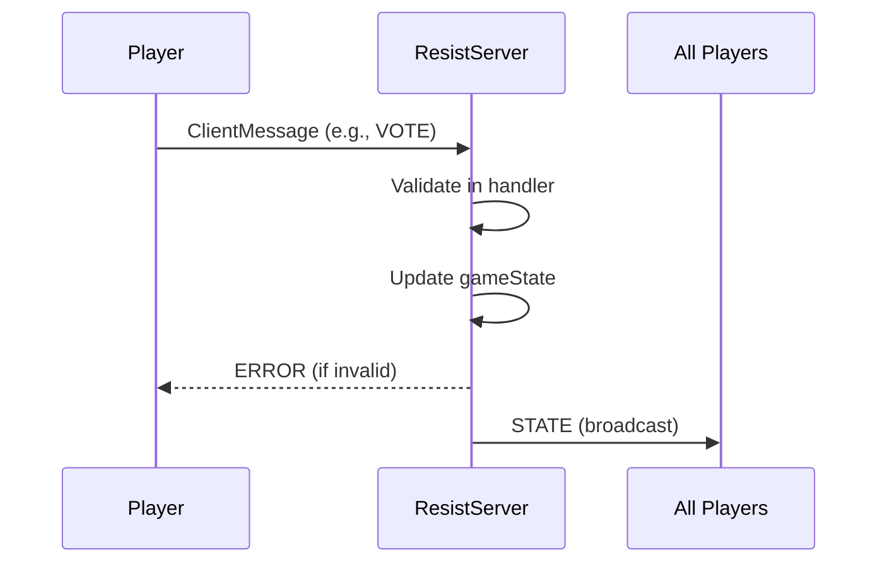

# Architecture - Skynet Infiltration Protocol

Detailed architecture documentation for the game's technical design, data flow, and patterns.

## System Overview



## Data Flow

### Connection Flow


### Game Action Flow


## Server Architecture

### ResistServer Class

The main server class handles all WebSocket connections and game logic.

```
ResistServer
├── Lifecycle
│   ├── onStart()         # Load state from storage
│   ├── onConnect()       # Handle new connection
│   ├── onClose()         # Handle disconnection
│   ├── onMessage()       # Route to handlers
│   └── onAlarm()         # Timer expiration
│
├── State Management
│   ├── saveState()       # Persist to PartyKit storage
│   ├── clearStorage()    # Clean up when closing
│   └── updateActivity()  # Track last activity
│
├── Context Providers
│   ├── getJoinContext()
│   ├── getGameContext()
│   ├── getTimerContext()
│   └── getDisconnectContext()
│
└── Broadcasting
    ├── broadcastState()  # Send sanitized state to all
    └── notifyRegistry()  # Update public rooms list
```

### Handler Modules

| Module | Responsibility |
|--------|----------------|
| `joinHandler.ts` | JOIN, LEAVE_ROOM, REMOVE_PLAYER |
| `gameHandlers.ts` | START_GAME, SELECT_PLAYER, SUBMIT_TEAM, VOTE, MISSION_ACTION |
| `disconnectHandlers.ts` | Pause/resume game, DISCONNECT_VOTE |
| `timerHandlers.ts` | Timer lifecycle (start, cancel, pause, resume) |

### State Sanitization

Before broadcasting, the server sanitizes state per-player:
- Hides other players' roles (unless game over)
- Hides mission outcomes until mission completes
- Includes player-specific session info

## Client Architecture

### Component Hierarchy

```
App
├── LanguageSelector (global)
├── Toast (notifications)
└── View (based on currentView state)
    ├── HomeView
    ├── SetupView
    ├── BrowseRoomsView
    ├── LobbyView
    │   ├── PlayerCard[]
    │   └── Config options
    ├── GameView
    │   ├── MissionTracker
    │   ├── VoteTracker
    │   ├── PlayerCard[]
    │   ├── TimerCircle
    │   └── Action buttons
    └── ReconnectView
```

### State Management

- **Server State**: Received via WebSocket, stored in `gameState`
- **Local State**: Player name (localStorage), session ID
- **View State**: Managed by `currentView` in App.tsx

### usePartySocket Hook

Handles WebSocket connection with:
- Automatic reconnection on disconnect
- Session persistence for rejoining
- Connection status tracking
- Message callbacks

## Key Design Decisions

### 1. Server-Authoritative State
All game logic runs on server. Client is display-only with input forwarding.

### 2. Stateless Handlers
Handlers receive context objects, don't hold state. Easy to test and reason about.

### 3. Session-Based Reconnection
Players get server-generated sessionId stored in localStorage. Allows rejoining same room after disconnect.

### 4. Spectator Mode
Late joiners become spectators (can watch, can't act) to prevent game disruption.

### 5. Timer System
Optional per-action timers with pause/resume during disconnects.

## Security Measures

| Measure | Implementation |
|---------|----------------|
| Session IDs | UUID v4, server-generated |
| Rate Limiting | 30 requests/minute per IP |
| Input Sanitization | All messages validated |
| Role Hiding | Roles only revealed at game end |
| CSP Headers | Configured in deployment |

## Persistence

- **Game State**: PartyKit room storage (survives hibernation)
- **Registry**: Separate PartyKit room for public room list
- **Client Session**: localStorage (survives page refresh)

---

See also:
- [SERVER.md](./SERVER.md) - Detailed server reference
- [CLIENT.md](./CLIENT.md) - Detailed client reference
- [STATE_MACHINE.md](./STATE_MACHINE.md) - Game phase diagrams
