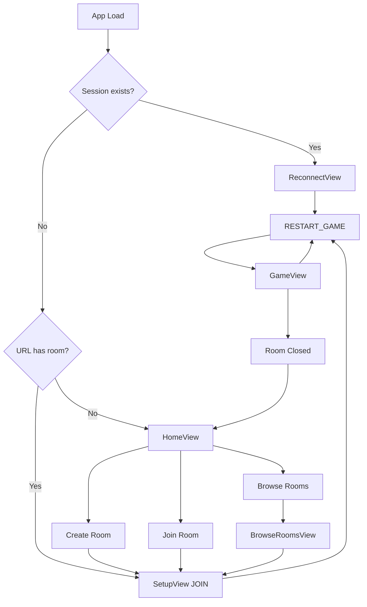

# Client Reference

Detailed documentation for the React frontend application.

## File Structure

```
src/
├── App.tsx              # Main component, routing, state
├── index.tsx            # React entry point
├── index.css            # Global styles
├── types.ts             # Client-specific types
├── constants.ts         # App constants
├── i18n.tsx             # Internationalization
├── views/               # Page components
│   ├── HomeView.tsx
│   ├── SetupView.tsx
│   ├── LobbyView.tsx
│   ├── GameView.tsx
│   ├── BrowseRoomsView.tsx
│   └── ReconnectView.tsx
├── components/          # Reusable UI
│   ├── PlayerCard.tsx
│   ├── MissionTracker.tsx
│   ├── VoteTracker.tsx
│   ├── TimerCircle.tsx
│   ├── LanguageSelector.tsx
│   ├── DisconnectWaitScreen.tsx
│   └── DisconnectVoteScreen.tsx
└── hooks/
    └── usePartySocket.ts
```

---

## App.tsx

Main application component handling routing and global state.

### State

| State | Type | Description |
|-------|------|-------------|
| `currentView` | enum | Current screen |
| `gameState` | GameState | From server |
| `playerName` | string | Local player name |
| `roomCode` | string | Current room |
| `connectionStatus` | string | WebSocket status |
| `toast` | object | Notification display |

### Views Enum

```typescript
type View = 'HOME' | 'SETUP' | 'JOIN' | 'BROWSE' | 'LOBBY' | 'GAME' | 'RECONNECT';
```

### View Routing Logic

```typescript
// Automatic view changes based on gameState.phase:
LOBBY or null → LOBBY view
TEAM_SELECTION | TEAM_VOTE | MISSION_EXECUTION | GAME_OVER | PAUSED_DISCONNECT | DISCONNECT_VOTE → GAME view
```

### Session Management

```typescript
// localStorage keys:
'resist_player_name'  // Persisted player name
'resist_app_session'  // { roomCode, playerName, avatarSeed }
```

---

## Views

### HomeView
Landing page with options:
- Create Room
- Join Room (with code)
- Browse Public Rooms

### SetupView
Player configuration:
- Name input (max 20 chars)
- Avatar selection (seed-based)
- Room name (if creating)

### LobbyView
Pre-game waiting room:
- Player list with avatars
- Host controls (settings, start)
- Room code display
- Timer configuration
- Public/private toggle

### GameView
Main game screen:
- Mission tracker (5 circles)
- Player cards (click to select)
- Action buttons (vote, mission action)
- Timer display (if enabled)
- Game log panel

### BrowseRoomsView
Public room listing:
- Fetches from registry
- Shows player count, status
- Direct join buttons

### ReconnectView
Reconnection handling:
- Shows reconnecting status
- Auto-attempts with sessionId

---

## Components

### PlayerCard
Player display with:
- Avatar (DiceBear Bottts)
- Name
- Role indicator (when revealed)
- Selection state
- Leader crown
- Host badge
- Disconnected indicator

**Props**:
```typescript
{
  player: Player;
  isLeader: boolean;
  isSelected: boolean;
  onClick?: () => void;
  showRole?: boolean;
  isCurrentPlayer: boolean;
}
```

### MissionTracker
Five mission circles showing:
- Status (pending/success/fail)
- Required players
- Two-fails indicator
- Current mission highlight

### VoteTracker
Failed vote count display:
- 5 circles
- Filled = failed vote
- 5th fail = Terminators win

### TimerCircle
Countdown timer with:
- Circular progress
- Remaining seconds
- Phase label
- Animation

### LanguageSelector
Toggle between PT-BR and EN:
- Flag icons
- Persists to localStorage

### DisconnectWaitScreen
Shown during PAUSED_DISCONNECT:
- Disconnected player name
- Attempt count
- Countdown timer

### DisconnectVoteScreen
Shown during DISCONNECT_VOTE:
- Vote buttons (End/Wait)
- Current votes tally

---

## Hooks

### usePartySocket

Main WebSocket hook for game communication.

**Usage**:
```typescript
const { 
  connect,
  disconnect,
  send,
  status,
  playerId 
} = usePartySocket({
  onStateUpdate: (state) => {},
  onError: (message) => {},
  onPlayerJoined: (name) => {},
  onPlayerLeft: (name) => {},
  onConnectionChange: (status) => {},
  onRoomClosed: () => {},
  onSessionEstablished: (sessionId, playerId) => {},
});
```

**Features**:
- Auto-reconnection on disconnect
- Session persistence
- Connection status tracking
- Message queue during reconnect
- **Mobile optimization**: Forces reconnection on iOS/Android when returning to tab (prevents "dead" sockets)

---

## Internationalization (i18n.tsx)

Translation system with React context.

**Hook**:
```typescript
const { t, language, setLanguage } = useTranslation();
```

**Usage**:
```typescript
t('lobby.startGame')  // Returns translated string
t('game.missionResult', { result: 'SUCCESS' })  // With interpolation
```

**Languages**:
- `en` - English
- `pt-br` - Portuguese (Brazil)

---

## Styling

### TailwindCSS Configuration

Custom theme in `tailwind.config.js`:
- Colors: dark theme with red accents
- Fonts: Rajdhani, Fira Code, Inter
- Animations: pulse, shake, glow

### Key CSS Classes

| Class | Usage |
|-------|-------|
| `glass-card` | Frosted glass effect |
| `btn-primary` | Red action button |
| `btn-secondary` | Gray button |
| `text-glow` | Glowing text effect |
| `animate-pulse-slow` | Slow pulse animation |

---

## State Flow Diagram



---

## Error Handling

### Toast Notifications
```typescript
// Types:
'error' - Red, error icon
'info' - Blue, info icon  
'success' - Green, check icon

// Auto-dismiss after 5 seconds
```

### Connection Errors
- Shows "Reconnecting..." status
- Auto-retry with exponential backoff
- Falls back to home on fatal error

---

See also:
- [ARCHITECTURE.md](./ARCHITECTURE.md) - System overview
- [MESSAGES.md](./MESSAGES.md) - Message protocol
