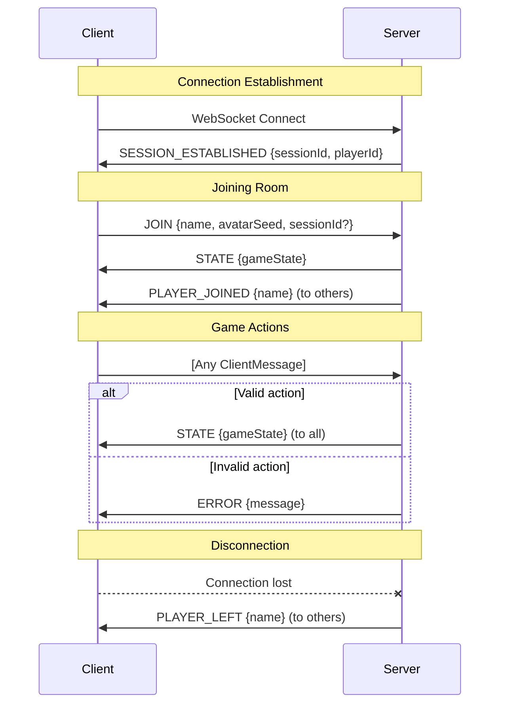

# WebSocket Message Protocol

Complete reference for all client-server messages in the game.

## Message Flow Diagram



---

## Client → Server Messages

All messages sent from client to server.

### JOIN
Join or create a room.

```typescript
{
  type: 'JOIN';
  name: string;           // Player display name (max 20 chars)
  avatarSeed: number;     // Random seed for avatar generation
  sessionId?: string;     // For reconnection (server-generated)
  isCreating?: boolean;   // True if creating new room
}
```

**Phases**: Any (before joining)  
**Response**: `STATE` or `ERROR`

---

### LEAVE_ROOM
Voluntarily leave the room.

```typescript
{ type: 'LEAVE_ROOM' }
```

**Phases**: Any  
**Response**: Connection closed, `PLAYER_LEFT` to others

---

### REMOVE_PLAYER
Host kicks a player (lobby only).

```typescript
{
  type: 'REMOVE_PLAYER';
  playerId: string;
}
```

**Phases**: `LOBBY`  
**Actor**: Host only  
**Response**: `STATE` or `ERROR`

---

### START_GAME
Host starts the game.

```typescript
{
  type: 'START_GAME';
  timerConfig?: {
    enabled: boolean;
    teamSelectionSeconds: number;  // 30-120
    teamVoteSeconds: number;       // 30-120
    missionVoteSeconds: number;    // 5-120
  }
}
```

**Phases**: `LOBBY`  
**Actor**: Host only  
**Requirements**: 5-10 connected players  
**Response**: `STATE` (phase → TEAM_SELECTION)

---

### SELECT_PLAYER
Leader toggles player for team.

```typescript
{
  type: 'SELECT_PLAYER';
  playerId: string;
}
```

**Phases**: `TEAM_SELECTION`  
**Actor**: Current leader only  
**Response**: `STATE`

---

### SUBMIT_TEAM
Leader confirms team selection.

```typescript
{ type: 'SUBMIT_TEAM' }
```

**Phases**: `TEAM_SELECTION`  
**Actor**: Current leader only  
**Requirements**: Exact mission size selected  
**Response**: `STATE` (phase → TEAM_VOTE)

---

### VOTE
Vote on proposed team.

```typescript
{
  type: 'VOTE';
  approve: boolean;
}
```

**Phases**: `TEAM_VOTE`  
**Actor**: All non-spectators (once per vote)  
**Response**: `STATE`

---

### MISSION_ACTION
Choose success or sabotage.

```typescript
{
  type: 'MISSION_ACTION';
  success: boolean;   // false = sabotage (Terminators only)
}
```

**Phases**: `MISSION_EXECUTION`  
**Actor**: Team members only (once per mission)  
**Note**: Humans always forced to `success: true`  
**Response**: `STATE`

---

### SET_ANONYMOUS_VOTES
Toggle anonymous voting.

```typescript
{
  type: 'SET_ANONYMOUS_VOTES';
  enabled: boolean;
}
```

**Phases**: `LOBBY`  
**Actor**: Host only  
**Response**: `STATE`

---

### SET_SHOW_REJECTION_COUNT
Toggle rejection count display.

```typescript
{
  type: 'SET_SHOW_REJECTION_COUNT';
  enabled: boolean;
}
```

**Phases**: `LOBBY`  
**Actor**: Host only  
**Response**: `STATE`

---

### SET_PUBLIC
Toggle public room visibility.

```typescript
{
  type: 'SET_PUBLIC';
  enabled: boolean;
}
```

**Phases**: `LOBBY`  
**Actor**: Host only  
**Response**: `STATE`

---

### TOGGLE_SPECTATOR
Toggle the player's status between active player and spectator.

```typescript
{
  type: 'TOGGLE_SPECTATOR';
  playerId?: string;
}
```

**Phases**: `LOBBY`
**Actor**: Any player (toggles self) or Host (toggles others)
**Response**: `STATE`

---

### TRANSFER_HOST
Transfer the host role to another active player.

```typescript
{
  type: 'TRANSFER_HOST';
  playerId: string;
}
```

**Phases**: `LOBBY`
**Actor**: Host only
**Response**: `STATE`

---

### RESTART_GAME
Start new game after game over.

```typescript
{ type: 'RESTART_GAME' }
```

**Phases**: `GAME_OVER`  
**Actor**: Host only  
**Response**: `STATE` (phase → LOBBY)

---

### DISCONNECT_VOTE
Vote to end or wait for disconnected player.

```typescript
{
  type: 'DISCONNECT_VOTE';
  endGame: boolean;   // true = end, false = wait
}
```

**Phases**: `DISCONNECT_VOTE`  
**Actor**: All non-spectators  
**Response**: `STATE`

---

## Server → Client Messages

All messages sent from server to client.

### STATE
Full game state broadcast.

```typescript
{
  type: 'STATE';
  state: GameState;   // Sanitized per-player
}
```

**Sanitization**:
- Roles hidden until `GAME_OVER`
- Mission outcomes hidden until complete
- Terminators see other Terminators

---

### ERROR
Error feedback.

```typescript
{
  type: 'ERROR';
  message: string;
}
```

---

### SESSION_ESTABLISHED
Confirms session for reconnection.

```typescript
{
  type: 'SESSION_ESTABLISHED';
  sessionId: string;    // Store in localStorage
  playerId: string;
}
```

---

### PLAYER_JOINED
Notification when player joins.

```typescript
{
  type: 'PLAYER_JOINED';
  name: string;
}
```

---

### PLAYER_LEFT
Notification when player leaves.

```typescript
{
  type: 'PLAYER_LEFT';
  name: string;
}
```

---

### ROOM_CLOSED
Room has been closed.

```typescript
{ type: 'ROOM_CLOSED' }
```

---

## Error Messages

Common error strings returned:

| Error | Cause |
|-------|-------|
| `"Apenas o host pode iniciar"` | Non-host tried to start |
| `"Precisa de 5-10 jogadores"` | Wrong player count |
| `"Apenas o líder pode selecionar"` | Non-leader selection |
| `"Espectadores não podem interagir"` | Spectator tried action |
| `"Você não está na equipe"` | Non-team member mission action |
| `"Sala não encontrada"` | Invalid room code |

---

See also:
- [STATE_MACHINE.md](./STATE_MACHINE.md) - Phase transitions
- [SERVER.md](./SERVER.md) - Handler implementations
