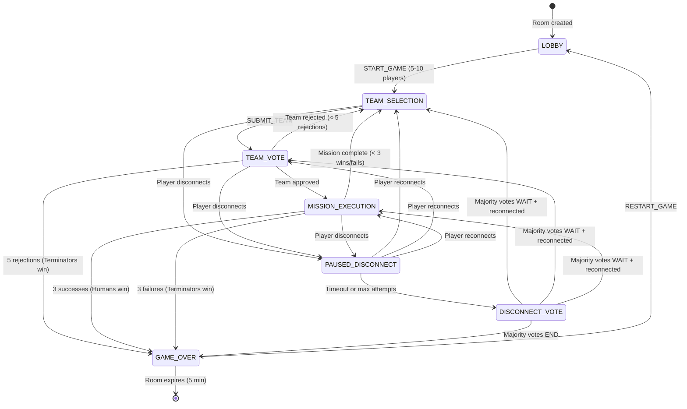
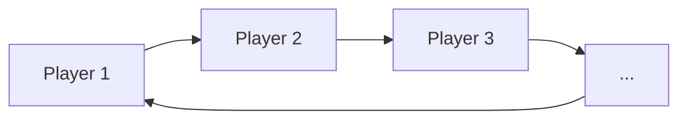
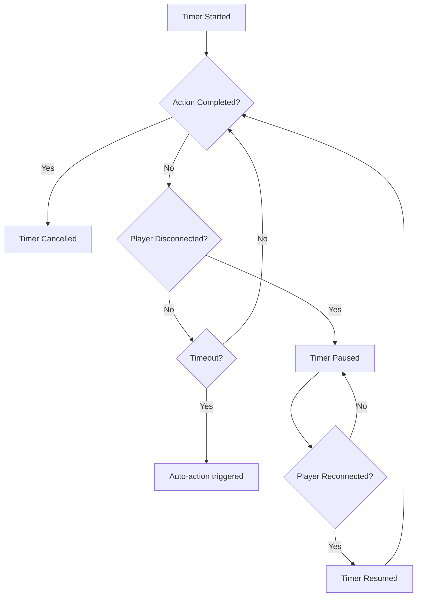

# Game State Machine

Complete documentation of game phases, transitions, and timer behavior.

## Phase Diagram



## Phase Details

### LOBBY
**Entry**: Room creation  
**Exit**: Host calls START_GAME with 5-10 players

| Allowed Actions | Actor |
|-----------------|-------|
| JOIN | Any |
| LEAVE_ROOM | Any |
| REMOVE_PLAYER | Host |
| SET_ANONYMOUS_VOTES | Host |
| SET_SHOW_REJECTION_COUNT | Host |
| SET_PUBLIC | Host |
| START_GAME | Host |

---

### TEAM_SELECTION
**Entry**: Game start or previous team rejected/mission complete  
**Exit**: Leader submits valid team

| Allowed Actions | Actor |
|-----------------|-------|
| SELECT_PLAYER | Current leader |
| SUBMIT_TEAM | Current leader |

**Timer**: `teamSelectionSeconds` (if enabled)  
**Timer Expiry**: Random team selected, auto-submit

---

### TEAM_VOTE
**Entry**: Leader submits team  
**Exit**: All players vote

| Allowed Actions | Actor |
|-----------------|-------|
| VOTE | All non-spectators (once each) |

**Timer**: `teamVoteSeconds` (if enabled)  
**Timer Expiry**: Non-voters auto-reject

**Outcome Calculation**:
```
approved = approvals > (playerCount / 2)
```

---

### MISSION_EXECUTION
**Entry**: Team approved  
**Exit**: All team members act

| Allowed Actions | Actor |
|-----------------|-------|
| MISSION_ACTION | Team members only (once each) |

**Timer**: `missionVoteSeconds` (if enabled)  
**Timer Expiry**: Non-actors auto-succeed

**Rules**:
- Humans MUST choose success
- Terminators can choose success or sabotage
- Mission fails if: `fails >= (requiresTwoFails ? 2 : 1)`

---

### PAUSED_DISCONNECT
**Entry**: Active player disconnects during game  
**Exit**: Player reconnects or timeout

| Tracking | Value |
|----------|-------|
| `disconnectInfo.pausedPhase` | Phase to return to |
| `disconnectInfo.pausedTimerRemainingMs` | Remaining timer (if any) |
| `disconnectInfo.waitingAttempt` | 1, 2, or 3 |

**Timeouts**:
- Attempt 1: 30 seconds
- Attempt 2: 30 seconds
- Attempt 3: 60 seconds
- After 3 attempts → DISCONNECT_VOTE

---

### DISCONNECT_VOTE
**Entry**: Max reconnect attempts exhausted  
**Exit**: Majority votes

| Allowed Actions | Actor |
|-----------------|-------|
| DISCONNECT_VOTE | All non-spectators |

**Options**:
- `endGame: true` - End game immediately
- `endGame: false` - Wait for player (30 more seconds)

---

### GAME_OVER
**Entry**: Win condition or vote to end  
**Exit**: Host restarts or room expires

| Allowed Actions | Actor |
|-----------------|-------|
| RESTART_GAME | Host |

**Room Expiry**: 5 minutes after game over

---

## Leader Rotation



Leader advances to next **active** (non-spectator, non-disconnected) player when:
1. Team is rejected
2. Mission completes

---

## Mission Requirements by Player Count

| Players | Terminators | M1 | M2 | M3 | M4 | M5 |
|:-------:|:-----------:|:--:|:--:|:--:|:--:|:--:|
| 5 | 2 | 2 | 3 | 2 | 3 | 3 |
| 6 | 2 | 2 | 3 | 4 | 3 | 3 |
| 7 | 3 | 2 | 3 | 3 | 4* | 4 |
| 8 | 3 | 3 | 4 | 4 | 5* | 5 |
| 9 | 3 | 3 | 4 | 4 | 5* | 5 |
| 10 | 4 | 3 | 4 | 4 | 5* | 5 |

*\* Requires 2 sabotages to fail*

---

## Timer Behavior



| Timer Type | Duration Range | Auto-Action |
|------------|---------------|-------------|
| `team_selection` | 30-120s | Random team, auto-submit |
| `team_vote` | 30-120s | Non-voters reject |
| `mission_vote` | 5-120s | Non-actors succeed |

---

See also:
- [MESSAGES.md](./MESSAGES.md) - Message protocol details
- [SERVER.md](./SERVER.md) - Handler implementations
