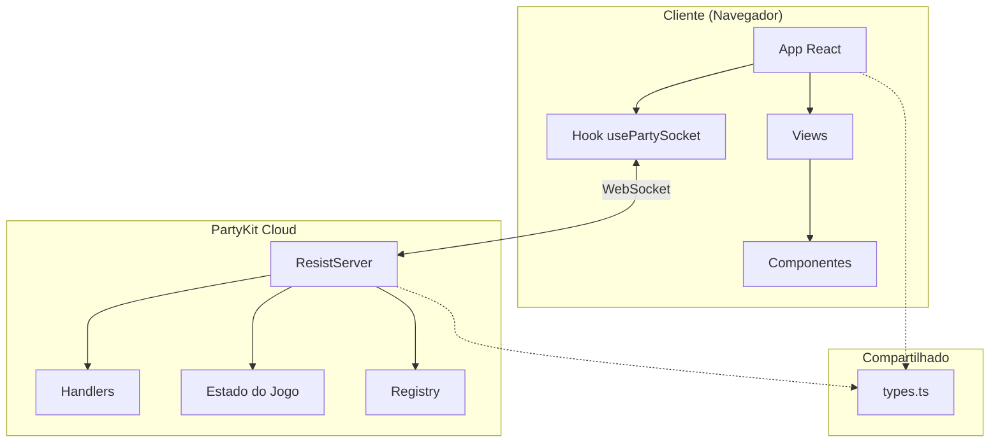
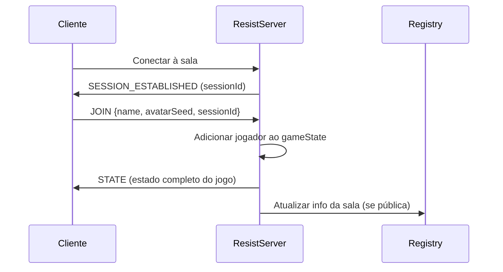
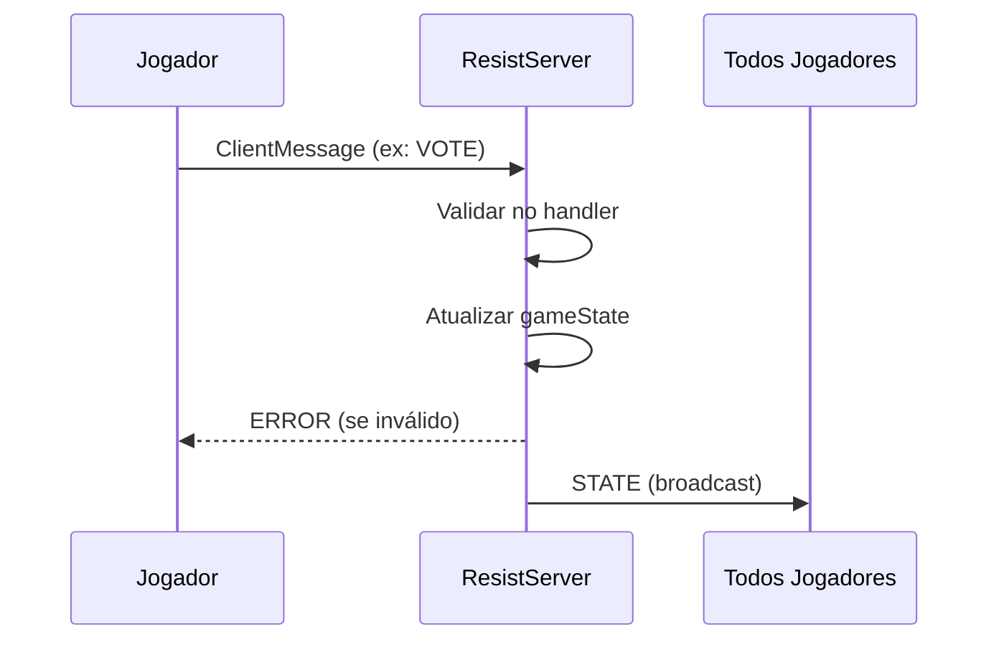

# Arquitetura - Skynet Infiltration Protocol

Documentação detalhada da arquitetura para o design técnico do jogo, fluxo de dados e padrões.

## Visão Geral do Sistema



## Fluxo de Dados

### Fluxo de Conexão


### Fluxo de Ação do Jogo


## Arquitetura do Servidor

### Classe ResistServer

A classe principal do servidor que lida com todas as conexões WebSocket e lógica do jogo.

```
ResistServer
├── Ciclo de Vida
│   ├── onStart()         # Carregar estado do storage
│   ├── onConnect()       # Lidar com nova conexão
│   ├── onClose()         # Lidar com desconexão
│   ├── onMessage()       # Rotear para handlers
│   └── onAlarm()         # Expiração de timer
│
├── Gerenciamento de Estado
│   ├── saveState()       # Persistir no storage PartyKit
│   ├── clearStorage()    # Limpar ao fechar
│   └── updateActivity()  # Rastrear última atividade
│
├── Provedores de Contexto
│   ├── getJoinContext()
│   ├── getGameContext()
│   ├── getTimerContext()
│   └── getDisconnectContext()
│
└── Broadcasting
    ├── broadcastState()  # Enviar estado sanitizado para todos
    └── notifyRegistry()  # Atualizar lista de salas públicas
```

### Módulos de Handler

| Módulo | Responsabilidade |
|--------|------------------|
| `joinHandler.ts` | JOIN, LEAVE_ROOM, REMOVE_PLAYER |
| `gameHandlers.ts` | START_GAME, SELECT_PLAYER, SUBMIT_TEAM, VOTE, MISSION_ACTION |
| `disconnectHandlers.ts` | Pausar/resumir jogo, DISCONNECT_VOTE |
| `timerHandlers.ts` | Ciclo de vida do timer (iniciar, cancelar, pausar, resumir) |

### Sanitização de Estado

Antes do broadcast, o servidor sanitiza o estado por jogador:
- Esconde papéis de outros jogadores (exceto game over)
- Esconde resultados de missão até completar
- Inclui info de sessão específica do jogador

## Arquitetura do Cliente

### Hierarquia de Componentes

```
App
├── LanguageSelector (global)
├── Toast (notificações)
└── View (baseado no estado currentView)
    ├── HomeView
    ├── SetupView
    ├── BrowseRoomsView
    ├── LobbyView
    │   ├── PlayerCard[]
    │   └── Opções de configuração
    ├── GameView
    │   ├── MissionTracker
    │   ├── VoteTracker
    │   ├── PlayerCard[]
    │   ├── TimerCircle
    │   └── Botões de ação
    └── ReconnectView
```

### Gerenciamento de Estado

- **Estado do Servidor**: Recebido via WebSocket, armazenado em `gameState`
- **Estado Local**: Nome do jogador (localStorage), ID de sessão
- **Estado da View**: Gerenciado por `currentView` em App.tsx

### Hook usePartySocket

Lida com conexão WebSocket com:
- Reconexão automática ao desconectar
- Persistência de sessão para reentrar
- Rastreamento de status de conexão
- Callbacks de mensagens

## Decisões de Design Principais

### 1. Estado Autoritativo no Servidor
Toda lógica do jogo roda no servidor. Cliente é apenas exibição com encaminhamento de input.

### 2. Handlers Sem Estado
Handlers recebem objetos de contexto, não mantêm estado. Fácil de testar e entender.

### 3. Reconexão Baseada em Sessão
Jogadores recebem sessionId gerado pelo servidor armazenado no localStorage. Permite reentrar na mesma sala após desconexão.

### 4. Modo Espectador
Quem entra depois vira espectador (pode assistir, não pode agir) para evitar interrupção do jogo.

### 5. Sistema de Timer
Timers opcionais por ação com pausa/resumo durante desconexões.

## Medidas de Segurança

| Medida | Implementação |
|--------|---------------|
| Session IDs | UUID v4, gerados no servidor |
| Rate Limiting | 30 requisições/minuto por IP |
| Sanitização de Input | Todas mensagens validadas |
| Ocultação de Papéis | Papéis só revelados no fim do jogo |
| Headers CSP | Configurados no deploy |

## Persistência

- **Estado do Jogo**: Storage da sala PartyKit (sobrevive hibernação)
- **Registry**: Sala PartyKit separada para lista de salas públicas
- **Sessão do Cliente**: localStorage (sobrevive refresh da página)

---

Veja também:
- [SERVER.md](./SERVER.md) - Referência detalhada do servidor
- [CLIENT.md](./CLIENT.md) - Referência detalhada do cliente
- [STATE_MACHINE.md](./STATE_MACHINE.md) - Diagramas de fases do jogo
