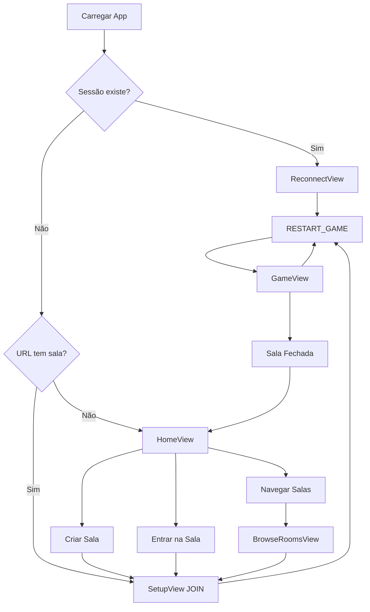

# Referência do Cliente

Documentação detalhada da aplicação frontend React.

## Estrutura de Arquivos

```
src/
├── App.tsx              # Componente principal, roteamento, estado
├── index.tsx            # Entry point React
├── index.css            # Estilos globais
├── types.ts             # Tipos específicos do cliente
├── constants.ts         # Constantes da aplicação
├── i18n.tsx             # Internacionalização
├── views/               # Componentes de página
│   ├── HomeView.tsx
│   ├── SetupView.tsx
│   ├── LobbyView.tsx
│   ├── GameView.tsx
│   ├── BrowseRoomsView.tsx
│   └── ReconnectView.tsx
├── components/          # UI reutilizável
│   ├── PlayerCard.tsx
│   ├── MissionTracker.tsx
│   ├── VoteTracker.tsx
│   ├── TimerCircle.tsx
│   ├── LanguageSelector.tsx
│   ├── DisconnectWaitScreen.tsx
│   └── DisconnectVoteScreen.tsx
└── hooks/
    └── usePartySocket.ts
```

---

## App.tsx

Componente principal da aplicação lidando com roteamento e estado global.

### Estado

| Estado | Tipo | Descrição |
|--------|------|-----------|
| `currentView` | enum | Tela atual |
| `gameState` | GameState | Do servidor |
| `playerName` | string | Nome do jogador local |
| `roomCode` | string | Sala atual |
| `connectionStatus` | string | Status WebSocket |
| `toast` | object | Exibição de notificação |

### Enum de Views

```typescript
type View = 'HOME' | 'SETUP' | 'JOIN' | 'BROWSE' | 'LOBBY' | 'GAME' | 'RECONNECT';
```

### Lógica de Roteamento de Views

```typescript
// Mudanças automáticas de view baseadas em gameState.phase:
LOBBY ou null → view LOBBY
TEAM_SELECTION | TEAM_VOTE | MISSION_EXECUTION | GAME_OVER | PAUSED_DISCONNECT | DISCONNECT_VOTE → view GAME
```

### Gerenciamento de Sessão

```typescript
// Chaves localStorage:
'resist_player_name'  // Nome do jogador persistido
'resist_app_session'  // { roomCode, playerName, avatarSeed }
```

---

## Views

### HomeView
Página inicial com opções:
- Criar Sala
- Entrar na Sala (com código)
- Navegar Salas Públicas

### SetupView
Configuração do jogador:
- Input de nome (máx 20 chars)
- Seleção de avatar (baseado em seed)
- Nome da sala (se criando)

### LobbyView
Sala de espera pré-jogo:
- Lista de jogadores com avatares
- Controles do host (configurações, iniciar)
- Exibição código da sala
- Configuração de timer
- Toggle público/privado

### GameView
Tela principal do jogo:
- Tracker de missões (5 círculos)
- Cards de jogadores (clique para selecionar)
- Botões de ação (votar, ação de missão)
- Exibição de timer (se habilitado)
- Painel de log do jogo

### BrowseRoomsView
Lista de salas públicas:
- Busca do registry
- Mostra contagem de jogadores, status
- Botões de entrada direta

### ReconnectView
Tratamento de reconexão:
- Mostra status de reconexão
- Auto-tenta com sessionId

---

## Componentes

### PlayerCard
Exibição do jogador com:
- Avatar (DiceBear Bottts)
- Nome
- Indicador de papel (quando revelado)
- Estado de seleção
- Coroa de líder
- Badge de host
- Indicador de desconectado

**Props**:
```typescript
{
  player: Player;
  isLeader: boolean;
  isSelected: boolean;
  onClick?: () => void;
  showRole?: boolean;
  isCurrentPlayer: boolean;
}
```

### MissionTracker
Cinco círculos de missão mostrando:
- Status (pendente/sucesso/falha)
- Jogadores necessários
- Indicador de duas falhas
- Destaque da missão atual

### VoteTracker
Exibição de contagem de votos falhados:
- 5 círculos
- Preenchido = voto falhado
- 5ª falha = Terminators vencem

### TimerCircle
Timer de contagem regressiva com:
- Progresso circular
- Segundos restantes
- Rótulo da fase
- Animação

### LanguageSelector
Alternar entre PT-BR e EN:
- Ícones de bandeira
- Persiste no localStorage

### DisconnectWaitScreen
Mostrado durante PAUSED_DISCONNECT:
- Nome do jogador desconectado
- Contagem de tentativas
- Timer de contagem regressiva

### DisconnectVoteScreen
Mostrado durante DISCONNECT_VOTE:
- Botões de voto (Encerrar/Esperar)
- Contagem de votos atual

---

## Hooks

### usePartySocket

Hook principal WebSocket para comunicação do jogo.

**Uso**:
```typescript
const { 
  connect,
  disconnect,
  send,
  status,
  playerId 
} = usePartySocket({
  onStateUpdate: (state) => {},
  onError: (message) => {},
  onPlayerJoined: (name) => {},
  onPlayerLeft: (name) => {},
  onConnectionChange: (status) => {},
  onRoomClosed: () => {},
  onSessionEstablished: (sessionId, playerId) => {},
});
```

**Features**:
- Auto-reconexão ao desconectar
- Persistência de sessão
- Rastreamento de status de conexão
- Fila de mensagens durante reconexão
- **Otimização mobile**: Força reconexão em iOS/Android ao voltar à aba (previne sockets "mortos")

---

## Internacionalização (i18n.tsx)

Sistema de tradução com React context.

**Hook**:
```typescript
const { t, language, setLanguage } = useTranslation();
```

**Uso**:
```typescript
t('lobby.startGame')  // Retorna string traduzida
t('game.missionResult', { result: 'SUCCESS' })  // Com interpolação
```

**Idiomas**:
- `en` - Inglês
- `pt-br` - Português (Brasil)

---

## Estilização

### Configuração TailwindCSS

Tema personalizado em `tailwind.config.js`:
- Cores: tema escuro com acentos vermelhos
- Fontes: Rajdhani, Fira Code, Inter
- Animações: pulse, shake, glow

### Classes CSS Principais

| Classe | Uso |
|--------|-----|
| `glass-card` | Efeito vidro fosco |
| `btn-primary` | Botão de ação vermelho |
| `btn-secondary` | Botão cinza |
| `text-glow` | Efeito texto brilhante |
| `animate-pulse-slow` | Animação pulse lenta |

---

## Diagrama de Fluxo de Estado



---

## Tratamento de Erros

### Notificações Toast
```typescript
// Tipos:
'error' - Vermelho, ícone de erro
'info' - Azul, ícone de info  
'success' - Verde, ícone de check

// Auto-dispensa após 5 segundos
```

### Erros de Conexão
- Mostra status "Reconectando..."
- Auto-retry com backoff exponencial
- Fallback para home em erro fatal

---

Veja também:
- [ARCHITECTURE.md](./ARCHITECTURE.md) - Visão geral do sistema
- [MESSAGES.md](./MESSAGES.md) - Protocolo de mensagens
