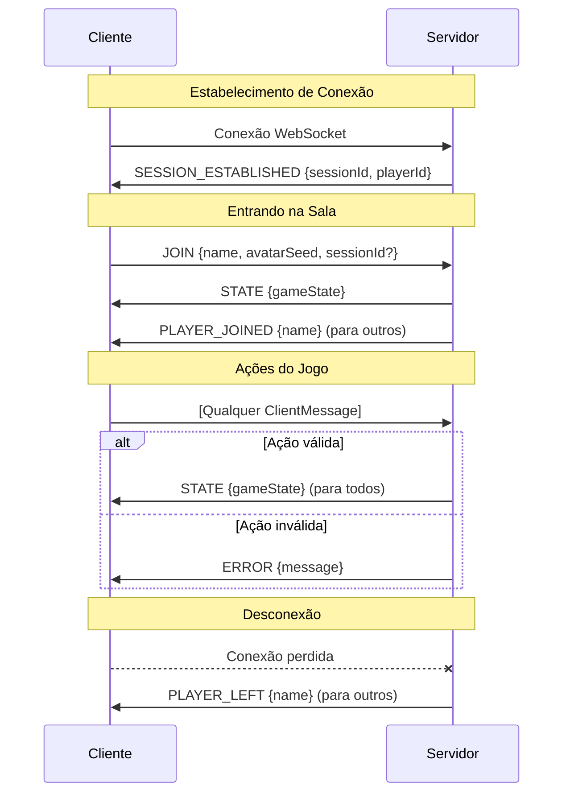

# Protocolo de Mensagens WebSocket

Referência completa para todas as mensagens cliente-servidor no jogo.

## Diagrama de Fluxo de Mensagens



---

## Mensagens Cliente → Servidor

Todas as mensagens enviadas do cliente para o servidor.

### JOIN
Entrar ou criar uma sala.

```typescript
{
  type: 'JOIN';
  name: string;           // Nome de exibição (máx 20 chars)
  avatarSeed: number;     // Seed aleatória para geração de avatar
  sessionId?: string;     // Para reconexão (gerado pelo servidor)
  isCreating?: boolean;   // True se criando nova sala
}
```

**Fases**: Qualquer (antes de entrar)  
**Resposta**: `STATE` ou `ERROR`

---

### LEAVE_ROOM
Sair voluntariamente da sala.

```typescript
{ type: 'LEAVE_ROOM' }
```

**Fases**: Qualquer  
**Resposta**: Conexão fechada, `PLAYER_LEFT` para outros

---

### REMOVE_PLAYER
Host expulsa um jogador (apenas lobby).

```typescript
{
  type: 'REMOVE_PLAYER';
  playerId: string;
}
```

**Fases**: `LOBBY`  
**Ator**: Apenas host  
**Resposta**: `STATE` ou `ERROR`

---

### START_GAME
Host inicia o jogo.

```typescript
{
  type: 'START_GAME';
  timerConfig?: {
    enabled: boolean;
    teamSelectionSeconds: number;  // 30-120
    teamVoteSeconds: number;       // 30-120
    missionVoteSeconds: number;    // 5-120
  }
}
```

**Fases**: `LOBBY`  
**Ator**: Apenas host  
**Requisitos**: 5-10 jogadores conectados  
**Resposta**: `STATE` (fase → TEAM_SELECTION)

---

### SELECT_PLAYER
Líder alterna jogador para o time.

```typescript
{
  type: 'SELECT_PLAYER';
  playerId: string;
}
```

**Fases**: `TEAM_SELECTION`  
**Ator**: Apenas líder atual  
**Resposta**: `STATE`

---

### SUBMIT_TEAM
Líder confirma seleção do time.

```typescript
{ type: 'SUBMIT_TEAM' }
```

**Fases**: `TEAM_SELECTION`  
**Ator**: Apenas líder atual  
**Requisitos**: Tamanho exato da missão selecionado  
**Resposta**: `STATE` (fase → TEAM_VOTE)

---

### VOTE
Votar no time proposto.

```typescript
{
  type: 'VOTE';
  approve: boolean;
}
```

**Fases**: `TEAM_VOTE`  
**Ator**: Todos não-espectadores (uma vez por votação)  
**Resposta**: `STATE`

---

### MISSION_ACTION
Escolher sucesso ou sabotagem.

```typescript
{
  type: 'MISSION_ACTION';
  success: boolean;   // false = sabotagem (apenas Terminators)
}
```

**Fases**: `MISSION_EXECUTION`  
**Ator**: Apenas membros do time (uma vez por missão)  
**Nota**: Humanos sempre forçados a `success: true`  
**Resposta**: `STATE`

---

### SET_ANONYMOUS_VOTES
Alternar votação anônima.

```typescript
{
  type: 'SET_ANONYMOUS_VOTES';
  enabled: boolean;
}
```

**Fases**: `LOBBY`  
**Ator**: Apenas host  
**Resposta**: `STATE`

---

### SET_SHOW_REJECTION_COUNT
Alternar exibição de contagem de rejeições.

```typescript
{
  type: 'SET_SHOW_REJECTION_COUNT';
  enabled: boolean;
}
```

**Fases**: `LOBBY`  
**Ator**: Apenas host  
**Resposta**: `STATE`

---

### SET_PUBLIC
Alternar visibilidade de sala pública.

```typescript
{
  type: 'SET_PUBLIC';
  enabled: boolean;
}
```

**Fases**: `LOBBY`  
**Ator**: Apenas host  
**Resposta**: `STATE`

---

### RESTART_GAME
Iniciar novo jogo após game over.

```typescript
{ type: 'RESTART_GAME' }
```

**Fases**: `GAME_OVER`  
**Ator**: Apenas host  
**Resposta**: `STATE` (fase → LOBBY)

---

### DISCONNECT_VOTE
Votar para encerrar ou esperar jogador desconectado.

```typescript
{
  type: 'DISCONNECT_VOTE';
  endGame: boolean;   // true = encerrar, false = esperar
}
```

**Fases**: `DISCONNECT_VOTE`  
**Ator**: Todos não-espectadores  
**Resposta**: `STATE`

---

## Mensagens Servidor → Cliente

Todas as mensagens enviadas do servidor para o cliente.

### STATE
Broadcast completo do estado do jogo.

```typescript
{
  type: 'STATE';
  state: GameState;   // Sanitizado por jogador
}
```

**Sanitização**:
- Papéis escondidos até `GAME_OVER`
- Resultados de missão escondidos até completar
- Terminators veem outros Terminators

---

### ERROR
Feedback de erro.

```typescript
{
  type: 'ERROR';
  message: string;
}
```

---

### SESSION_ESTABLISHED
Confirma sessão para reconexão.

```typescript
{
  type: 'SESSION_ESTABLISHED';
  sessionId: string;    // Armazenar no localStorage
  playerId: string;
}
```

---

### PLAYER_JOINED
Notificação quando jogador entra.

```typescript
{
  type: 'PLAYER_JOINED';
  name: string;
}
```

---

### PLAYER_LEFT
Notificação quando jogador sai.

```typescript
{
  type: 'PLAYER_LEFT';
  name: string;
}
```

---

### ROOM_CLOSED
Sala foi fechada.

```typescript
{ type: 'ROOM_CLOSED' }
```

---

## Mensagens de Erro

Strings de erro comuns retornadas:

| Erro | Causa |
|------|-------|
| `"Apenas o host pode iniciar"` | Não-host tentou iniciar |
| `"Precisa de 5-10 jogadores"` | Quantidade errada de jogadores |
| `"Apenas o líder pode selecionar"` | Seleção por não-líder |
| `"Espectadores não podem interagir"` | Espectador tentou ação |
| `"Você não está na equipe"` | Ação de missão por não-membro |
| `"Sala não encontrada"` | Código de sala inválido |

---

Veja também:
- [STATE_MACHINE.md](./STATE_MACHINE.md) - Transições de fase
- [SERVER.md](./SERVER.md) - Implementações dos handlers
