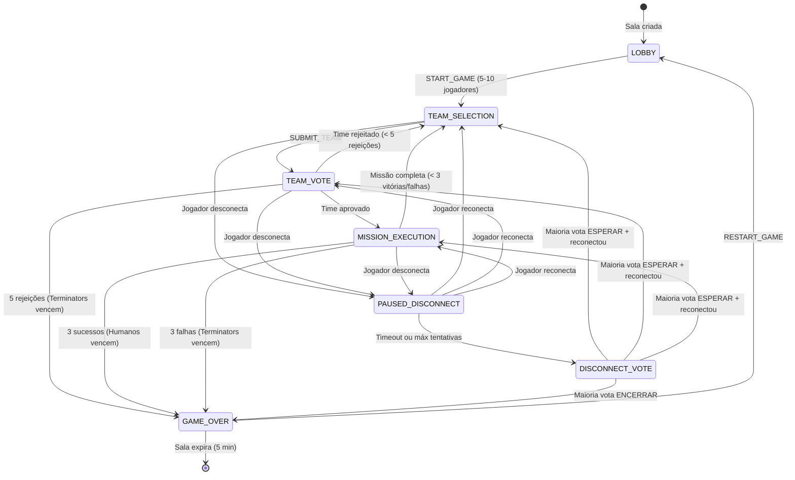
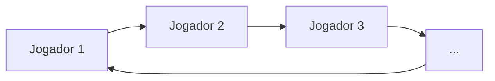
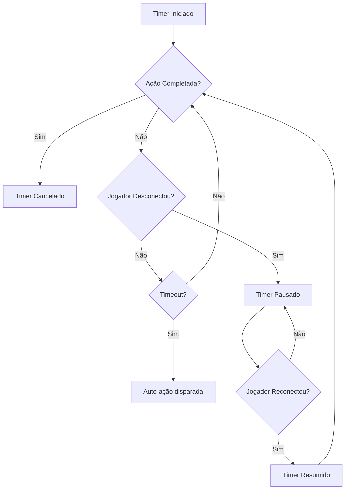

# Máquina de Estados do Jogo

Documentação completa das fases do jogo, transições e comportamento de timers.

## Diagrama de Fases



## Detalhes das Fases

### LOBBY
**Entrada**: Criação da sala  
**Saída**: Host chama START_GAME com 5-10 jogadores

| Ações Permitidas | Ator |
|------------------|------|
| JOIN | Qualquer |
| LEAVE_ROOM | Qualquer |
| REMOVE_PLAYER | Host |
| SET_ANONYMOUS_VOTES | Host |
| SET_SHOW_REJECTION_COUNT | Host |
| SET_PUBLIC | Host |
| START_GAME | Host |

---

### TEAM_SELECTION
**Entrada**: Início do jogo ou time rejeitado/missão completa anterior  
**Saída**: Líder submete time válido

| Ações Permitidas | Ator |
|------------------|------|
| SELECT_PLAYER | Líder atual |
| SUBMIT_TEAM | Líder atual |

**Timer**: `teamSelectionSeconds` (se habilitado)  
**Expiração do Timer**: Time aleatório selecionado, auto-submete

---

### TEAM_VOTE
**Entrada**: Líder submete time  
**Saída**: Todos jogadores votam

| Ações Permitidas | Ator |
|------------------|------|
| VOTE | Todos não-espectadores (uma vez cada) |

**Timer**: `teamVoteSeconds` (se habilitado)  
**Expiração do Timer**: Não-votantes auto-rejeitam

**Cálculo do Resultado**:
```
aprovado = aprovações > (quantidadeJogadores / 2)
```

---

### MISSION_EXECUTION
**Entrada**: Time aprovado  
**Saída**: Todos membros do time agem

| Ações Permitidas | Ator |
|------------------|------|
| MISSION_ACTION | Apenas membros do time (uma vez cada) |

**Timer**: `missionVoteSeconds` (se habilitado)  
**Expiração do Timer**: Não-agentes auto-sucedem

**Regras**:
- Humanos DEVEM escolher sucesso
- Terminators podem escolher sucesso ou sabotagem
- Missão falha se: `falhas >= (requiresTwoFails ? 2 : 1)`

---

### PAUSED_DISCONNECT
**Entrada**: Jogador ativo desconecta durante jogo  
**Saída**: Jogador reconecta ou timeout

| Rastreamento | Valor |
|--------------|-------|
| `disconnectInfo.pausedPhase` | Fase para retornar |
| `disconnectInfo.pausedTimerRemainingMs` | Timer restante (se houver) |
| `disconnectInfo.waitingAttempt` | 1, 2 ou 3 |

**Timeouts**:
- Tentativa 1: 30 segundos
- Tentativa 2: 30 segundos
- Tentativa 3: 60 segundos
- Após 3 tentativas → DISCONNECT_VOTE

---

### DISCONNECT_VOTE
**Entrada**: Máximo de tentativas de reconexão esgotado  
**Saída**: Maioria vota

| Ações Permitidas | Ator |
|------------------|------|
| DISCONNECT_VOTE | Todos não-espectadores |

**Opções**:
- `endGame: true` - Encerrar jogo imediatamente
- `endGame: false` - Esperar jogador (mais 30 segundos)

---

### GAME_OVER
**Entrada**: Condição de vitória ou voto para encerrar  
**Saída**: Host reinicia ou sala expira

| Ações Permitidas | Ator |
|------------------|------|
| RESTART_GAME | Host |

**Expiração da Sala**: 5 minutos após fim do jogo

---

## Rotação de Líder



Líder avança para o próximo jogador **ativo** (não-espectador, não-desconectado) quando:
1. Time é rejeitado
2. Missão é completada

---

## Requisitos de Missão por Número de Jogadores

| Jogadores | Terminators | M1 | M2 | M3 | M4 | M5 |
|:---------:|:-----------:|:--:|:--:|:--:|:--:|:--:|
| 5 | 2 | 2 | 3 | 2 | 3 | 3 |
| 6 | 2 | 2 | 3 | 4 | 3 | 3 |
| 7 | 3 | 2 | 3 | 3 | 4* | 4 |
| 8 | 3 | 3 | 4 | 4 | 5* | 5 |
| 9 | 3 | 3 | 4 | 4 | 5* | 5 |
| 10 | 4 | 3 | 4 | 4 | 5* | 5 |

*\* Requer 2 sabotagens para falhar*

---

## Comportamento do Timer



| Tipo de Timer | Faixa de Duração | Auto-Ação |
|---------------|------------------|-----------|
| `team_selection` | 30-120s | Time aleatório, auto-submete |
| `team_vote` | 30-120s | Não-votantes rejeitam |
| `mission_vote` | 5-120s | Não-agentes sucedem |

---

Veja também:
- [MESSAGES.md](./MESSAGES.md) - Detalhes do protocolo de mensagens
- [SERVER.md](./SERVER.md) - Implementações dos handlers
